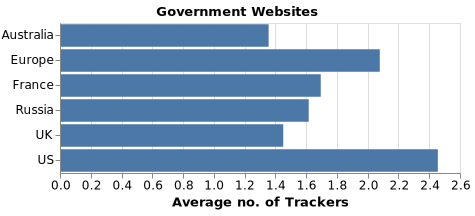

title: Government websites
subtitle: if you are not the product you're the taxpayer
author: privacy team
type: article
publish: True
date: 2018-10-10
tags: trackers, government
header_img: blog/gov_trackers/gov.png
+++

_This post is one of our regular monthly blogs accompanying an update to the data
displayed on WhoTracks.Me. In these posts we introduce what data has been added as
well as point out interesting trends and case-studies we found in the last month._

 

On WhoTracks.me we typically profile websites where we see presence of tracking.
Last month we noticed the unexpected debut of some government sites. The almost
overused cliché _"If you are not paying for the product, you are the product"_,
does not really apply to government sites, as we're all certainly paying.

NB: Note that this is not a comprehensive survey of the
tracking landscape on government websites. However, we plan to do one in the
future.

Here's a list of the government websites ending up in this month's release:
<table class="table table-hover">
  <thead>
    <tr>
      <th>Country</th>
      <th>Site</th>
    </tr>
  </thead>
  <tbody>
    <tr>
      <td>Australia</td>
      <td><a href="https://whotracks.me/websites/bom.gov.au.html">bom.gov.au</a> </td>
    </tr>
    <tr>
      <td>Europe</td>
      <td><a href="https://whotracks.me/websites/europa.eu.html">europa.eu</a></td>
    </tr>
    <tr>
      <td>France</td>
      <td><a href="https://whotracks.me/websites/ants.gouv.fr.html">ants.gouv.fr</a></td>
    </tr>
    <tr>
      <td>France</td>
      <td><a href="https://whotracks.me/websites/legifrance.gouv.fr.html">legifrance.gouv.fr</a></td>
    </tr>
    <tr>
      <td>France</td>
      <td><a href="https://whotracks.me/websites/impots.gouv.fr.html">impots.gouv.fr</a></td>
    </tr>
    <tr>
      <td>Russia</td>
      <td><a href="https://whotracks.me/websites/ca.gov.html">ca.gov</a></td>
    </tr>
    <tr>
      <td>UK</td>
      <td><a href="https://whotracks.me/websites/tax.service.gov.uk.html">tax.service.gov.uk</a></td>
    </tr>
    <tr>
      <td>US</td>
      <td><a href="https://whotracks.me/websites/ca.gov.html">ca.gov</a></td>
    </tr>
    <tr>
      <td>US</td>
      <td><a href="https://whotracks.me/websites/dhs.gov.html">dhs.gov</a></td>
    </tr>
    <tr>
      <td>US</td>
      <td><a href="https://whotracks.me/websites/irs.gov.html">irs.gov</a></td>
    </tr>
    <tr>
      <td>US</td>
      <td><a href="https://whotracks.me/websites/nih.gov.html">nih.gov</a></td>
    </tr>
    <tr>
      <td>US</td>
      <td><a href="https://whotracks.me/websites/noaa.gov.html">noaa.gov</a></td>
    </tr>
    <tr>
      <td>US</td>
      <td><a href="https://whotracks.me/websites/state.gov.html">state.gov</a></td>
    </tr>
    <tr>
      <td>US</td>
      <td><a href="https://whotracks.me/websites/weather.gov.html">weather.gov</a></td>
    </tr>
  </tbody>
</table>

It also surprised us that Germany (where the majority of our contributors reside)
does not appear. A brief check of a few sites like
<a href="https://bundestag.de">bundestag.de</a> and the
<a href="https://bzst.de">Federal Tax Office</a> shows a choice for self hosted
solutions.

Lastly, this month, we also saw some considerable changes in the number of trackers
in certain sites. The largest decreaese was seen on <a href="../websites/wallstreet-online.de.html">wallstreet-online.de</a> whereas
the largest increase in <a href="../websites/yaplakal.com.html">yaplakal.com</a>.
