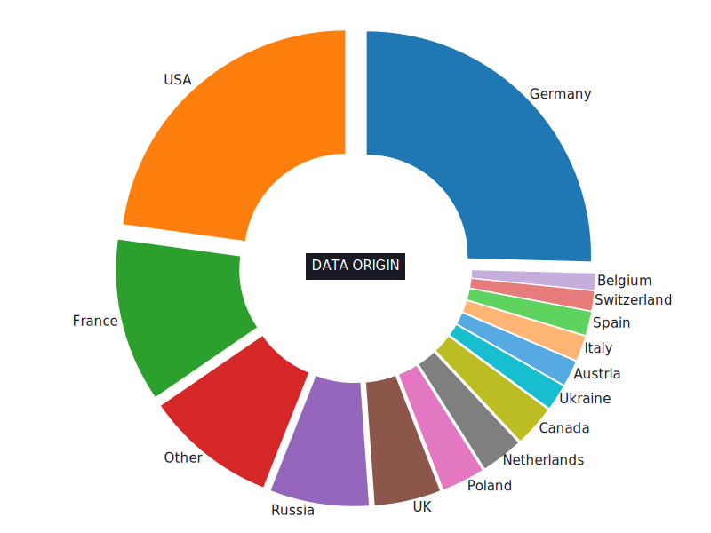
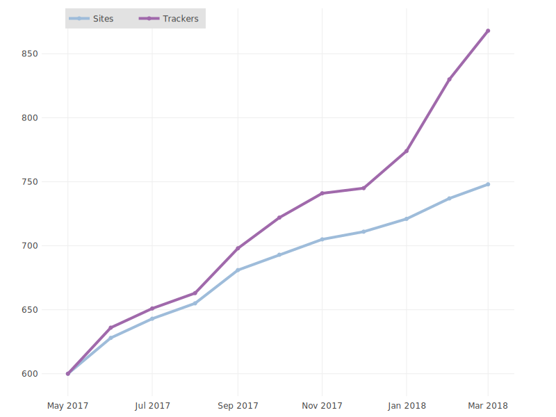
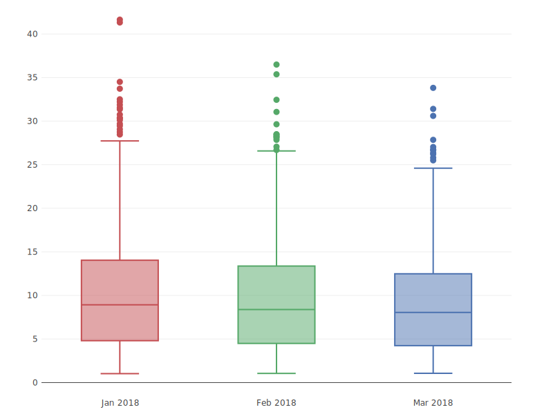
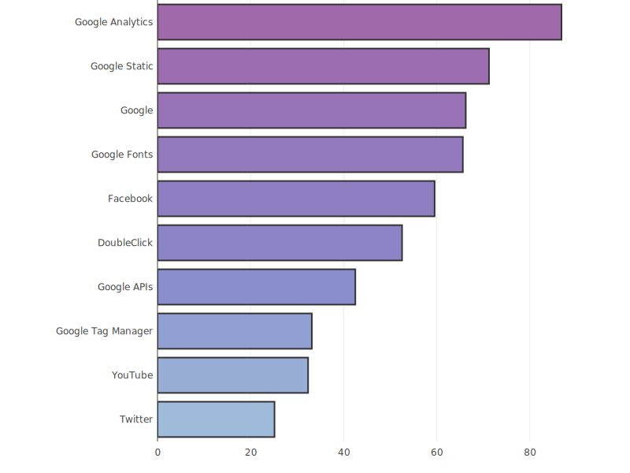

title: April Update - Preparing for Internationalisation
subtitle: A new data format to ease access to tracker data.
author: privacy team
type: article
publish: True
date: 2018-04-12
tags: blog, update
header_img: blog/blog-data-apr18.png
+++

_This post is one of our regular monthly blogs accompanying an update to the data
displayed on WhoTracks.Me. In these posts we introduce what data has been added as well
as point out interesting trends and case-studies we found in the last month. Previous
month's posts can be found here: [February 2018](./update_feb_2018.html),
[January 2018](./update_jan_2018.html), [December 2017](./update_dec_2017.html)._

This month we have a big update to the site. We have restructured the data we publish to
make it easier to use, increased the number of entries we publish, and we have laid the
groundwork for internationalised versions of WhoTracks.Me - that means you can see how
tracking differs between different countries.

Thanks to integration with Ghostery 8 we collected significantly more tracker data this
month, covering 360 million page loads. This is spread over countries across the world,
with Germany and the USA the most represented.


<p class="img-caption">Figure 1: Page loads per country, March 2018</p>

This volume of data will also enable us to publish WhoTracks.Me content for individual
countries, something we plan to add later this month.


## Data restructuring

We have updated the structure of data which we publish in our [repository](https://github.com/cliqz-oss/whotracks.me/) to make it both easier to use and more
scalable as we add more data. We now publish CSV files each month for each of the
following:

 * `domains.csv`: Top third-party domains seen tracking.
 * `trackers.csv`: Top trackers - this combines domains known be operated by the same tracker.
 * `companies.csv`: Top companies - aggregates the stats for trackers owned by the same company.
 * `sites.csv`: Stats for number of trackers seen on popular websites.
 * `site_trackers.csv`: Stats for each tracker on each site.

These files can then be loaded with popular data-analysis tools such as
[Pandas](https://pandas.pydata.org/). We have also rewritten the code to render the site
to take advantage of Pandas. We expose the dataframes via the `DataSource` class which
loads data from all CSV files:

```python
from whotracksme.data.loader import DataSource
data = DataSource()
len(data.trackers.df)
>> 7928
```

We have also updated the criteria by which we include trackers and sites on the main site.
We now 'rollover' entries, so once they have been included once, we will keep publishing
data (until they completely disappear from the data). This has the effect of naturally
growing the number of trackers and sites we publish. We currently have data on
868 trackers and 748 websites published:

```python
pd.DataFrame({
    'trackers': data.trackers.df.groupby('month').count()['tracker'],
    'sites': data.sites.df.groupby('month').count()['site']
}).plot()
```


<p class="img-caption">Figure 2: Growth of trackers and sites</p>


The per-site trend for average number of trackers continues a slightly downward trend,
although the average is still high at 9 trackers per page. There are several possible
reasons for this, it is not necessarily that sites are using fewer trackers! The
proportion of data from Ghostery users continues to increase, and these users will
disproportionately block many trackers. This has an effect on the average number of
trackers, because it prevents the blocked trackers from loading others. The data shows
also that the average incidence of blocking for trackers increased to 25% in March, up
from 20% in February.

```python
sns.boxplot(
  data=data.sites.df[data.sites.df.month >= '2018-01'],
  x='month',
  y='trackers'
)
```


<p class="img-caption">Figure 3: Average trackers per page since January</p>


```python
(data.trackers.df[data.trackers.df.month >= '2018-01']
  .groupby('month')
  ['has_blocking'].mean() * 100).plot()
```


<p class="img-caption">Figure 4: Blocking Trend since January</p>


As in previous months, we look at sites' changing their trackers. [fewo-direct.de](../websites/fewo-direkt.de.html), [brigitte.de](../websites/brigitte.de.html) and [gutefrage.net](../websites/gutefrage.net.html) all had 5 fewer trackers on average per page this month. However, each of these still has over 50 trackers with some kind of presence, showing that this is more likely a side-effect of increased blocking than an active effort to reduce tracking on their sites. [klingel.de](../websites/klingel.de.html) and [informationvine.com](../websites/informationvine.com.html) see the largest increase in tracking of the sites we currently monitor.

<table class="table table-hover">
  <thead>
    <tr>
      <th>Site</th>
      <th>Trackers</th>
      <th>Change since February</th>
    </tr>
  </thead>
  <tbody>
    <tr>
      <td>informationvine.com</td>
      <td>18.3</td>
      <td><i class="fa fa-caret-up" style="color: red; margin-right: 10px"></i> +6.4</td>
    </tr>
    <tr>
      <td>klingel.de</td>
      <td>26.7</td>
      <td><i class="fa fa-caret-up" style="color: red; margin-right: 10px"></i> +5.3</td>
    </tr>
    <tr>
      <td>gutefrage.net</td>
      <td>13.0</td>
      <td><i class="fa fa-caret-down" style="color: green; margin-right: 10px"></i> -5.6</td>
    </tr>
    <tr>
      <td>brigitte.de</td>
      <td>19.5</td>
      <td><i class="fa fa-caret-down" style="color: green; margin-right: 10px"></i> -5.8</td>
    </tr>
    <tr>
      <td>fewo-direkt.de</td>
      <td>16.0</td>
      <td><i class="fa fa-caret-down" style="color: green; margin-right: 10px"></i> -6.6</td>
    </tr>
  </tbody>
</table>
<p class="img-caption">Table 1: Websites Tracking Trends</p>

A side-effect of the filtering we added in this new data pipeline is that the site reach
for top trackers has increased. In the previous analysis a long-tail of very rarely
visited sites reduced effective site reach. With this factor reduced, we get a real
sense of the coverage of the largest trackers, with Google Analytics reaching 85% of
popular sites, and Facebook almost 60%. The data can easily be retrieved
as shown below:

```python
df = data.trackers.get_snapshot().sort_values(by='site_reach', ascending=False).head(10)
df['name'] = df.id.apply(func=lambda x: data.app_info[x]['name'])
```

<p class="img-caption">Figure 5: Reach of top 10 trackers across popular websites</p>


If you want to delve deeper into our data, it is available on the [WhoTracks.Me Github Repository](https://github.com/cliqz-oss/whotracks.me/tree/master/whotracksme/data), and as a [pip package](https://pypi.python.org/pypi/whotracksme/).

_NB: The code snippets here will not generate the presented plots. Full code snippets
for the plots in this post are available in this [Jupyter Notebook](https://nbviewer.jupyter.org/github/cliqz-oss/whotracks.me/blob/master/contrib/wtm_april_update.ipynb)._