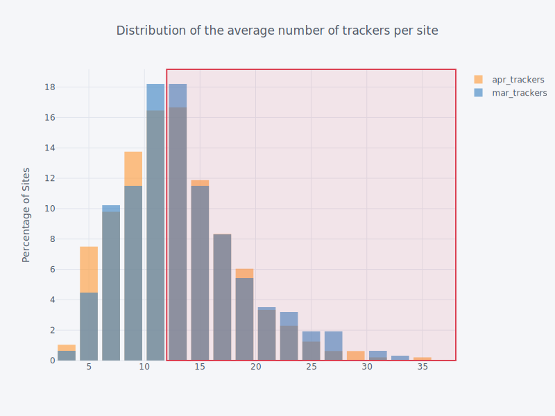

title: May Update - Countdown to GDPR
subtitle: Facebook's "Tough" month and Google's recommendation
author: privacy team
type: article
publish: True
date: 2018-05-11
tags: blog, update
header_img: blog/update_may18/release.png
+++

_This post is one of our regular monthly blogs accompanying an update to the data
displayed on WhoTracks.Me. In these posts we introduce what data has been added as well
as point out interesting trends and case-studies we found in the last month. Previous
month's posts can be found here: [April 2018](./update_apr_2018.html),
[February 2018](./update_feb_2018.html), [January 2018](./update_jan_2018.html),
[December 2017](./update_dec_2017.html)._

This month we update the site with data from 340 million page loads during April 2018. We expand
the number of trackers shown to 951, and the number of websites to 1330. As this will be the last
full month before the [GDPR](https://en.wikipedia.org/wiki/General_Data_Protection_Regulation)
comes into force for European users, this will provide a benchmark to assess whether there is an
observable difference on the tracking ecosystem.

This month also saw our new paper **"WhoTracks.Me: Monitoring the online tracking landscape at scale"**
published on [Arxiv](https://arxiv.org/abs/1804.08959). This paper covers the methodology behind
the data we collect here, and how we ensure no private information can be leaked during this
process.

## Facebook's Tough Month

[Facebook](../trackers/facebook.html) have been in the news a lot in the last month, and with
the `#deletefacebook` trending, will there have been an effect on their operations and bottom
line? We [already reported](https://www.ghostery.com/blog/ghostery-news/report-have-publishers-banned-facebook-trackers-from-their-pages-after-the-cambridge-analytica-scandal/)
that despite strong criticism in the press, the same news sites did not stop using Facebook's
tracking tools.

Figure 1: Facebook Tracker's reach over time, April 2018

The data we release this month shows that this continues to be the case, with no
drop in tracking reach for the [Facebook tracker](../trackers/facebook.html).

Note that `reach` refers to the percentage of total page loads where the Facebook
tracker was seen to be present, whereas `site reach` refers to the percentage of
domains.

## Google and the Countdown to GDPR

With GDPR coming into effect on 25th May, we will soon see if it has an impact on the number of
third-party trackers loaded on web pages. [Recent reports indicate](https://adexchanger.com/online-advertising/googles-gdpr-consent-tool-will-limit-publishers-to-12-ad-tech-vendors/)
that Google will encourage publishers to reduce the number of AdTech vendors they use, in order to
increase the chance of getting consent for tracking from users. If this is the case, we should
expect this change to be visible in the WhoTracks.Me data.

As we reported [last month](./update_apr_2018.html), we observe a gradual decline in the average
number of trackers seen on websites. However, if we look at sites which use Google's [Doubleclick](../trackers/doubleclick.html)
Ad Network on more than half their traffic, the majority of them are still well-above
this proposed 12 tracker limit (red area). With only a few weeks to go, there will still be be a
significant number of sites over the limit.

Figure 2: Sites that use Google's DoubleClick Ad Network, April 2018

If we were to consider the most extreme scenario, where Google compels all customers use their GDPR
consent system for European users, and enforces a 12 vendor limit in the process, this could
have a significant impact on the ecosystem. If we extrapolate from WhoTracks.Me data, capping all
these sites to 12 trackers means that over **1,300 trackers** would disappear from sites. AdTech
companies deeper in the supply chain may be completely cut out unless they have direct publisher
relationships which enable them to make the vendor shortlist.

Such a sharp change in the ecosystem is unlikely, but it demonstrates the power of Google's market
dominance, that they would be able to unilaterally pull the plug on a lot of their competition. We
will continue to monitor the ecosystem to quantify any changes to tracking, and look forward to
reporting the changes, if any, caused by the new regulation.

## Notable Changes

As customary, here below are the sites with the most notable changes this month. The
largest increase in the average number of trackers per page load was measured in
[markt.de](https://whotracks.me/websites/markt.de.html), and the largest decrease in
[babbel.com](https://whotracks.me/websites/babbel.com.html).

<table class="table table-hover">
  <thead>
    <tr>
      <th>Site</th>
      <th>Trackers</th>
      <th>Change since February</th>
    </tr>
  </thead>
  <tbody>
    <tr>
      <td>markt.de</td>
      <td>28.6</td>
      <td><i class="fa fa-caret-up" style="color: red; margin-right: 10px"></i> +10.8</td>
    </tr>
    <tr>
      <td>klingel.de</td>
      <td>16.3</td>
      <td><i class="fa fa-caret-up" style="color: red; margin-right: 10px"></i> +4.6</td>
    </tr>
    <tr>
      <td>bento.de</td>
      <td>15.6</td>
      <td><i class="fa fa-caret-down" style="color: green; margin-right: 10px"></i> -3.6</td>
    </tr>
    <tr>
      <td>babbel.com</td>
      <td>4.6</td>
      <td><i class="fa fa-caret-down" style="color: green; margin-right: 10px"></i> -8.1</td>
    </tr>
  </tbody>
</table>

Table 1: Websites Tracking Trends

_NB: The code used to generate the data and plots for this post is available in
[Jupyter Notebook](https://nbviewer.jupyter.org/github/cliqz-oss/whotracks.me/blob/master/contrib/wtm_may_update.ipynb)._